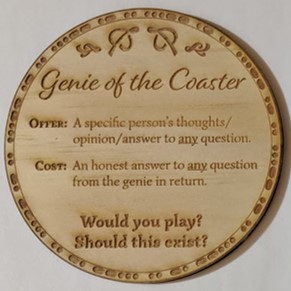

|  |   |

For me this coaster just beggs more questions...

#### Does this already exist?

#### If it does, or were to, exist, who would own, control and benefit from it?

#### Do we value knowing truths about others and how we relate to society over our own privacy?

#### How readily do we give up privacy and what has changed to make us more willing to do so?

Share you thoughts about what we're willing to exchange privacy:
| [Facebook](facebook.com) | [Twitter](twitter.com) | [Reddit](reddit.com) | [Portfolio Page](http://sambackwell.com) |

## [Click here for more coaster conversations](./coasters)