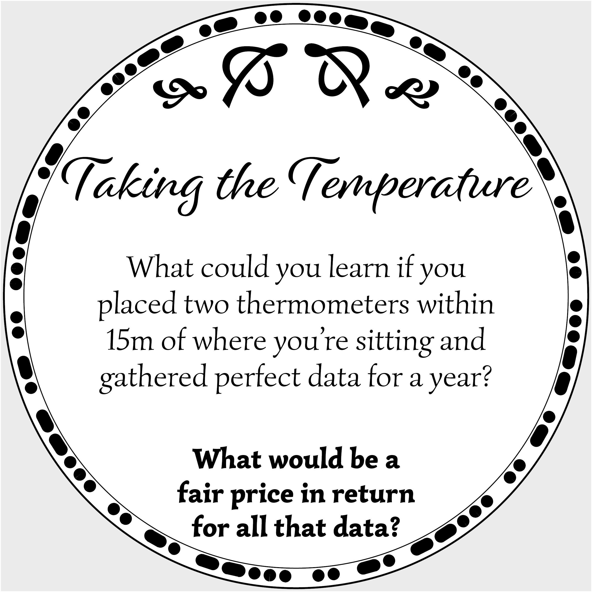

|  |   |
| | [Physical Coaster Coming Tuesday] | 

## What could be learnt?

* One thermometer outside gets you the ambient external temperature:
    * Seasons and macro trends
    * Recreate and compare the daily forecast
    * A baseline to anything going on in the building

* One thermometer inside and one outside gets you a lot of engineering information abuot the building
    * What the heating/cooling cycle is and its efficency
    * How effective the insulation is (both at trappiung and keeping out temperature)

* If you know its just one person in the room, how much body warmth they are generating. This could correlate to some health conditiions (cold or fever) or medication side-effects. 

* With two thermometers in a single room and a known number of people could model where they are in relation to the thermometers and triangulate.

## Unintended Use

Wifi through walls

## [Click here for more coaster conversations](./coasters)