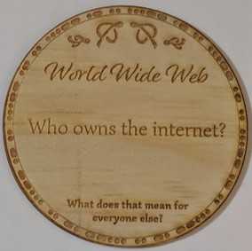

|  |   |

## Origins of the Internet

Academia and defence laid the groundwork for the internet

General Internet History: [SciShow - YouTUbe](https://www.youtube.com/watch?v=1UStbvRnwmQ)

Internet coming to Australia: [AARNet Project](https://www.aarnet.edu.au/about-us/publications/aarnet-book)

## Who owns the internet now?

* The companies running the servers?
    * [Amazon server outage takes down internet](https://siliconangle.com/2018/03/02/amazon-cloud-outage-knocks-240-online-services/)

* The companies building the physical infrastructure?
    * [NBN co](https://www.nbnco.com.au/residential/learn/how-the-nbn-network-gets-to-you)

* The internet service providers who provide your access to the internet?
    * [Your ISP knows everything about you](https://digital.com/blog/isp-tracking/)

* Or is the internet within the public domain?
    * [On This Day 25 Years Ago, the Web Became Public Domain](https://www.popularmechanics.com/culture/web/a20104417/www-public-domain/)
    * Internet freedom is the objective of organisations like the Internet Society - [You Can Build the Internet](https://www.internetsociety.org/blog/2016/12/you-can-build-the-internet/)

## [Click here for more coaster conversations](./coasters)