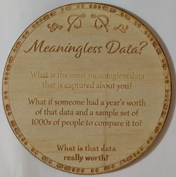

|  |   |

## Suggestions for meaningless data

* Height
    * The change in your individual height over time when growing indicates overall health
    * The small reduction in height over a day gives an indication of physical activity and general body posture as your spine compresses to different degrees

* Music taste
    * Feeds the algorithms that suggest particular ads, products and services to you
    * Combined with other people's personal tastes in music models can be built to better predict things you may buy and begin to describe (with varying accuracy) elements of your personality (and even if it doesn't work, someone can still try)

* Print credit
    * There's easy data in patterns of behaviour that emerge and indicate that you're on campus at certain times.
    * If the charges come with a tag of which location you are printing at (very likely) then it indicates which areas of campus you base yourself out of, where you've explored and feel comfortable running in to print.
    * If there is a queue at a printer (continuous charges coming from a specific machine) your use of it indicates a willingness to wait in lines or using a printer in an adjacent location indicates a preference to seek alternative solutions.

* "The Victorian government tracks individual crayfish tags that I request and use"
    * That's a good one, there's obviously value to a research project somewhere about the crayfish themselves. However, your patterns over a year compared to other people could rank your fishing abilities and from there attempt to determine when you had the availability to go fishing. 
    * The data entry process (which entails logging crayfish data online) also builds a pattern of behaviour around when you are most free, and have accessibility to the internet, in the evenings.

## Read more

Data can also gain meaning when paired with data or placed into different contexts (contexts that didn't necessarily even exist when the data was recorded). In 2018 the location and movement of personal around military bases was revealed through their exercises data. The data was anonymised before being placed on a world wide heat map but the location data was also sensitive in this situation. 

[ABC Article](https://www.abc.net.au/news/science/2018-01-29/strava-heat-map-shows-military-bases-and-supply-routes/9369490)

Individual pieces of data may be meaningless but when aggregated they are already costing some people real money.

ProPublica: [Health Insurers Are Vacuuming Up Details About You](https://www.propublica.org/article/health-insurers-are-vacuuming-up-details-about-you-and-it-could-raise-your-rates)

## [Click here for more coaster conversations](./coasters)