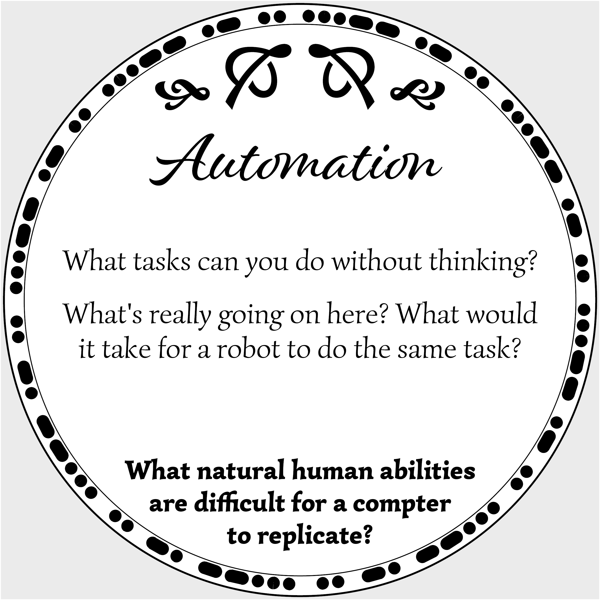
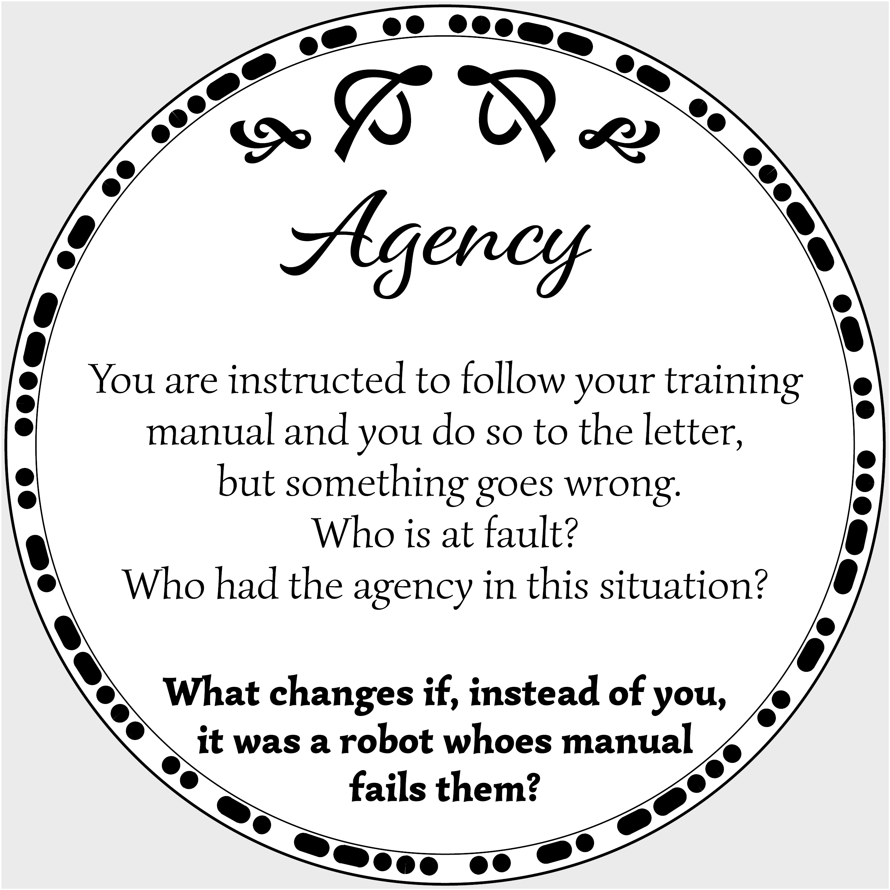

	Sparking a conversation can be as simple as seeding the right idea in the right place. A good fact, or even a good story isn’t enough, you must connect, engage and invite contribution. Sometimes the best conversations start with a problem to ponder – generating insight, understanding and an appreciation of others’ perspectives even if there is no objective answer possible (which can itself be an insight). 

	In widening the scope of our pre-semester assignment, I sought to spark conversations of complex ideas that repeated throughout our coursework without requiring prerequisite knowledge. My goal was to create thought provoking coasters, to go around any table, which would spark an engaging discussion.

|  |  |
|  |  |
|  |  |

