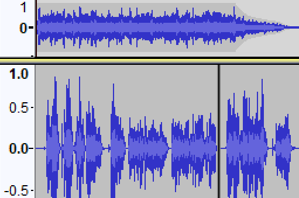

## Top Level Heading

	This site documents my journey to realising the central importance of communicating our understanding, predictions, and plans about the fourth industrial revolution as unfolds around us all. Bringing everyone into the conversation will require engagement, education, and debate in many forms and venues. Many of these conversations have already started but we also have a long way yet to go on a journey that does not have a fixed or clear destination. 

	This website holds online landing pages and resources in support of Sam Backwell's Masters of Studies work. Please click below to explore the content. 

| [Coaster Conversations](./coasters) | [Talking Through Ideas ](./podcast) | 
| |   | 
| [Instant Engagement Poster](HAL/index.html) | [HAL and the NAS](./NAS) |
| |   | 

